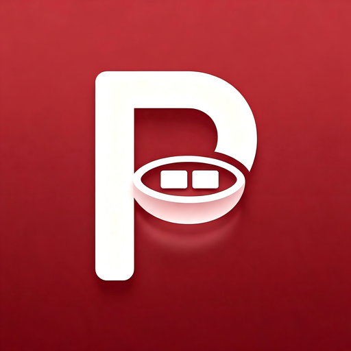
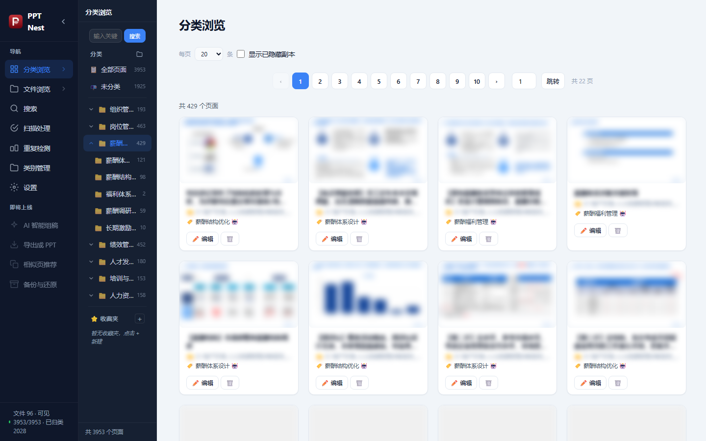
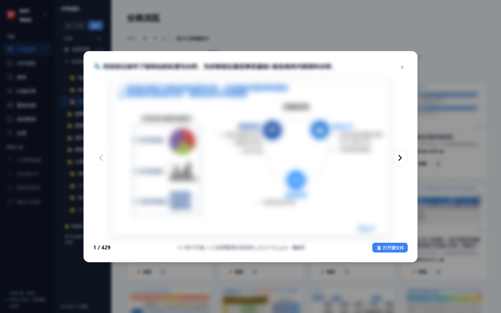
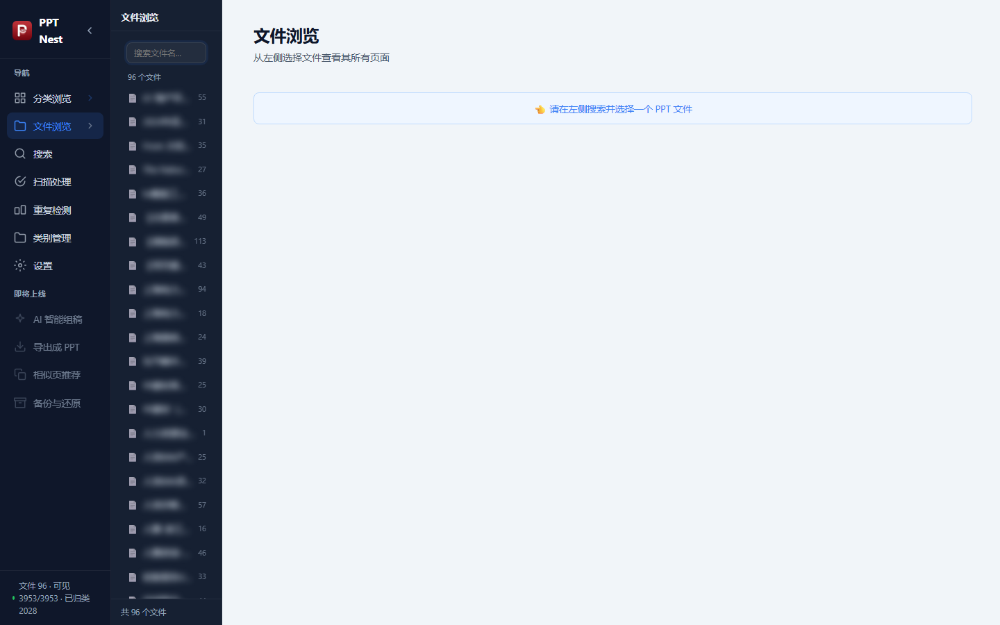
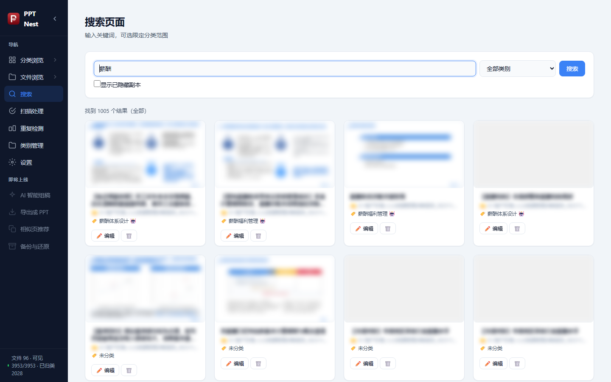
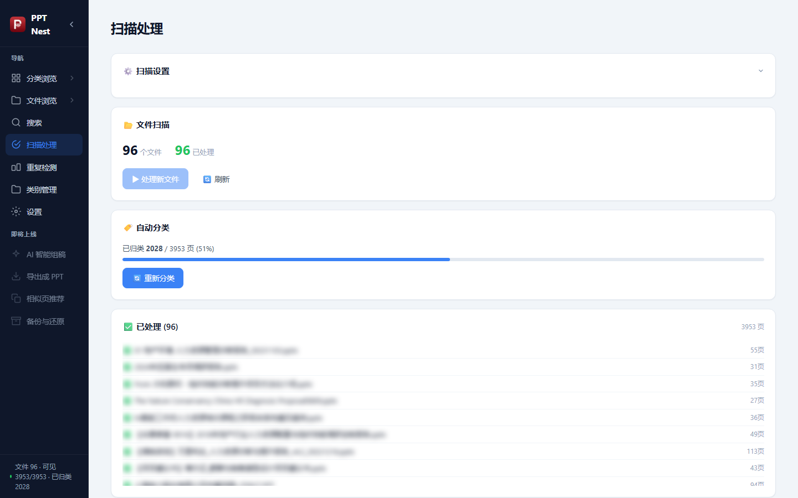
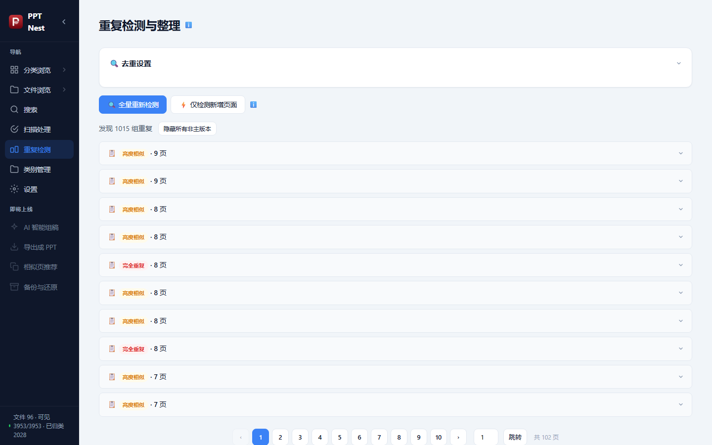
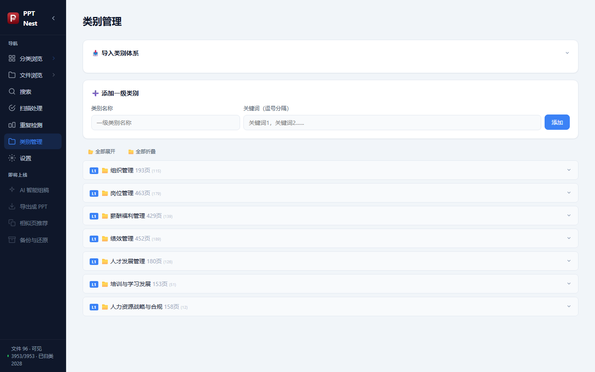
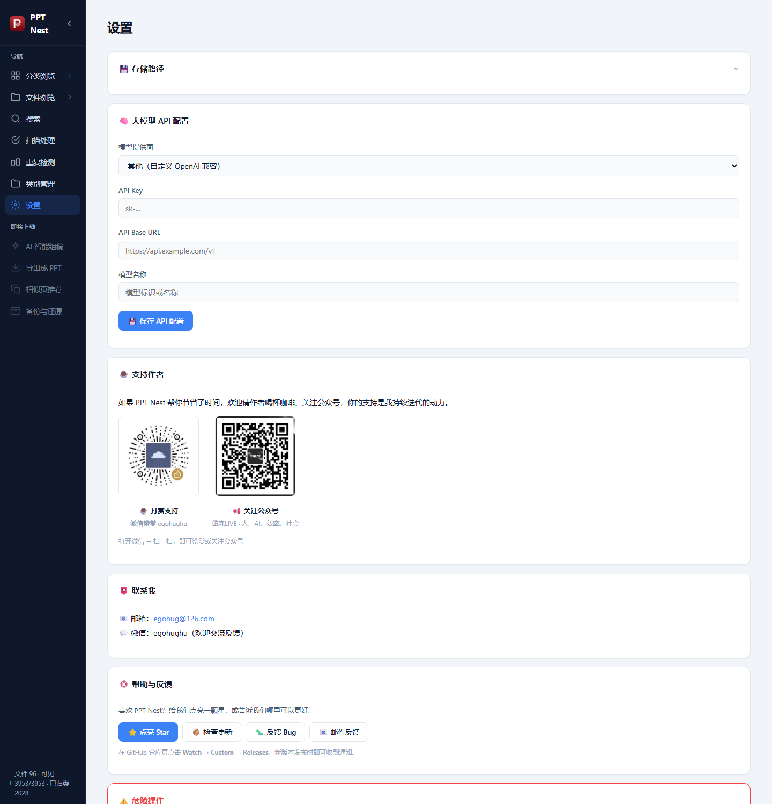

<p align="center">
  
</p>

<h1 align="center">PPT Nest · 片巢</h1>

<p align="center">
  一个本地化的 PPT 素材库管理工具：把你积攒的几百个 PPT 文件拆解成一张张可检索、可归类、可收藏的幻灯片页面。
</p>

<p align="center">
  
  
  
  
  
</p>

---

## ✨ 这是什么？

做咨询、做培训、做方案的人，电脑里往往躺着成百上千个 PPT。想找"一页讲薪酬体系的图"时，却只能一个文件一个文件地翻。

**PPT Nest 把"文件"打散成"页面"**：

- 扫描指定文件夹，自动解析每个 PPT 的每一页
- 为每页生成缩略图、提取标题和正文
- 用关键词（可选大模型兜底）自动归类到你的分类体系
- 跨文件找出完全重复 / 高度相似的页面，一键隐藏副本
- 像图库一样浏览、搜索、收藏、放大预览，还能一键跳回源文件

## 🎯 核心功能

| 功能 | 说明 |
|---|---|
| 📂 批量扫描 | 递归扫描 PPT/PPTX，增量处理（按 mtime + 大小判断变更），损坏文件部分解析并明确提示 |
| 🖼️ 缩略图 | PowerPoint COM 导出真实渲染图；无 Office 环境时自动生成占位图 |
| 🏷️ 智能归类 | 关键词加权打分（标题 ×2、正文 ×1、路径 ×0.6）+ N 级子类级联；支持智谱 / DeepSeek / 通义 / OpenAI 等任意 OpenAI 兼容大模型兜底 |
| 🔁 重复检测 | 内容哈希精确去重 + n-gram 预筛 + fuzz 相似度检测（可调阈值），独立子进程运行不卡界面 |
| ⭐ 收藏夹 | 跨文件挑选页面组成自己的专题合集 |
| 🔍 全文搜索 | 标题 + 正文 LIKE 检索，支持按分类/文件/收藏夹筛选 |
| 🗂️ 多级分类 | 最多 5 级分类树，支持 JSON 一键导入/导出（附 AI 生成分类体系的提示词模板） |
| 🔍 放大预览 | 键盘 ← → 翻页浏览，可直接打开对应源 PPT |

## 🏗️ 架构

```
┌─────────────────────────── Electron 桌面壳 ───────────────────────────┐
│  main.js  窗口管理 / 后端进程生命周期 / 端口自适应                        │
│  frontend/  原生 JS + CSS 单页应用（无框架，轻量）                       │
└──────────────────────────────┬────────────────────────────────────────┘
                               │ REST API (127.0.0.1)
┌──────────────────────────────┴────────────────────────────────────────┐
│  Python 后端 (FastAPI + Uvicorn，PyInstaller 打包为 server.exe)         │
│  ├── server.py        API 路由 / 任务锁 / 进度状态                      │
│  ├── scanner.py       扫描调度（解析→缩略图→归类→入库）                  │
│  ├── ppt_parser.py    python-pptx + PowerPoint COM 双通道解析           │
│  ├── classifier.py    关键词分类器（加权/互斥规则/级联下沉）              │
│  ├── llm_classifier.py 大模型归类（OpenAI 兼容协议）                     │
│  ├── dedup.py         去重算法（哈希 + Jaccard 预筛 + rapidfuzz）       │
│  ├── dedup_worker.py  去重独立子进程（进度经 JSON 文件通信）              │
│  └── database.py      SQLite (WAL) 数据层                              │
└────────────────────────────────────────────────────────────────────────┘
```

**技术栈**：Electron · FastAPI · SQLite(WAL) · python-pptx · pywin32(COM) · Pillow · rapidfuzz · PyInstaller · electron-builder

## 📸 截图

| 分类浏览 | 放大预览 |
|---|---|
|  |  |

| 文件浏览 | 搜索 |
|---|---|
|  |  |

| 扫描处理 | 重复检测 |
|---|---|
|  |  |

| 类别管理 | 设置 |
|---|---|
|  |  |

> 完整使用说明见 [docs/使用说明.md](docs/使用说明.md)

## 🚀 下载与安装

到 [Releases](../../releases) 下载 `PPT Nest Setup x.x.x.exe`，双击安装即可。

> 真实缩略图渲染与 .ppt 旧格式解析依赖本机已安装 Microsoft PowerPoint；未安装时仍可正常使用（缩略图为占位图，仅支持 .pptx）。

> 本软件以安装包形式发布，不提供源码；个人可免费使用，详情见下方许可证。

## ⚙️ 常见问题

**Q: 扫描很慢？**
A: 瓶颈在 PowerPoint COM 渲染缩略图，每页约 0.5~2 秒属正常。扫描在后台线程运行，可随时取消。

**Q: 大模型归类怎么配置？**
A: 设置 → 大模型 API 配置，选择提供商（智谱/DeepSeek/通义/Kimi/OpenAI 等）填写 API Key 即可。扫描设置中选择"关键词 + LLM"混合模式，只有关键词拿不准的页面才会调用大模型，省钱省时。

**Q: 删除页面会发生什么？**
A: 会从源 PPT 文件中真实删除该页并同步刷新缩略图与页码，操作前请确认源文件未被 Office 打开占用。

**Q: 数据存在哪里？**
A: 安装版默认在 `%APPDATA%\ppt-nest\data`（可在设置中修改数据目录），包含 SQLite 数据库与缩略图，卸载不丢失。

## 🐛 反馈问题

遇到 Bug 或有功能建议，欢迎通过以下任一方式反馈：

- **提 Issue**（推荐）：到 [Issues](../../issues) 选择「Bug 反馈」或「功能建议」模板
- **软件内反馈**：设置 → 帮助与反馈 → 点「反馈 Bug」或「邮件反馈」
- **邮件**：[egohug@126.com](mailto:egohug@126.com) · **微信**：`egohughu`

反馈时附上版本号（设置 → 帮助与反馈 可见）和 `pptnest.log` 日志片段，能帮我们更快定位问题。

## 🔔 订阅更新

想第一时间用上新功能？到本仓库页点 **Watch → Custom → 勾选 Releases**，每次发布新版本都会收到通知。也欢迎顺手点个 ⭐ Star 支持一下。

## 📄 许可证

本软件为**专有软件**（见 [LICENSE](LICENSE)），源代码不予公开：

- ✅ 个人免费安装使用，可自由用于学习、日常工作、研究等非商业用途
- ❌ 禁止反编译、修改、分发、再许可，以及任何形式的商业用途

如需商业授权，请通过邮箱 [egohug@126.com](mailto:egohug@126.com) 或微信 `egohughu` 联系。

## 📮 联系我

- 📧 邮箱：[egohug@126.com](mailto:egohug@126.com)
- 💬 微信：`egohughu`（欢迎交流反馈）

## ☕ 支持作者

PPT Nest 由个人开发者利用业余时间持续打磨。如果它帮你节省了时间、提升了效率，欢迎：

- ⭐ **点个星标**：这是对我最大的鼓励，也能帮更多人发现它
- ☕ **请我喝杯咖啡**：微信赞赏 `egohughu`，你的支持是我持续迭代的动力
- 📢 **关注公众号「岱森LIVE」**：聚焦 **人、AI、效率、社会**，分享效率工具、AI 实践与方法论思考

<p align="center">
  
</p>

<p align="center"><strong>如果 PPT Nest 对你有帮助，请点个 ⭐ 星标，让更多人找到它！</strong></p>

<p align="center"><sub>你的支持，是我继续把它做好的最大动力 ❤️</sub></p>
